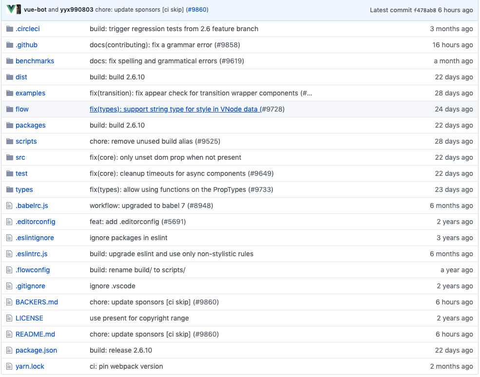

# vue 从熟悉api到熟悉源码
github源码地址 https://github.com/vuejs/vue

首先熟悉一下目录结构 当然把代码checkout出来会更方便操作点



yarn.lock 不看 是个包管理工具生成的文件

package.json 这个熟悉 这个相当于工程的索引 经验告诉我们直接看script

``` json

"scripts": {
    "dev": "rollup -w -c scripts/config.js --environment TARGET:web-full-dev",
    "dev:cjs": "rollup -w -c scripts/config.js --environment TARGET:web-runtime-cjs",
    "dev:esm": "rollup -w -c scripts/config.js --environment TARGET:web-runtime-esm",
    "dev:test": "karma start test/unit/karma.dev.config.js",
    "dev:ssr": "rollup -w -c scripts/config.js --environment TARGET:web-server-renderer",
    "dev:compiler": "rollup -w -c scripts/config.js --environment TARGET:web-compiler ",
    "dev:weex": "rollup -w -c scripts/config.js --environment TARGET:weex-framework",
    "dev:weex:factory": "rollup -w -c scripts/config.js --environment TARGET:weex-factory",
    "dev:weex:compiler": "rollup -w -c scripts/config.js --environment TARGET:weex-compiler ",
    "build": "node scripts/build.js",
    "build:ssr": "npm run build -- web-runtime-cjs,web-server-renderer",
    "build:weex": "npm run build -- weex",
    "test": "npm run lint && flow check && npm run test:types && npm run test:cover && npm run test:e2e -- --env phantomjs && npm run test:ssr && npm run test:weex",
    "test:unit": "karma start test/unit/karma.unit.config.js",
    "test:cover": "karma start test/unit/karma.cover.config.js",
    "test:e2e": "npm run build -- web-full-prod,web-server-basic-renderer && node test/e2e/runner.js",
    "test:weex": "npm run build:weex && jasmine JASMINE_CONFIG_PATH=test/weex/jasmine.json",
    "test:ssr": "npm run build:ssr && jasmine JASMINE_CONFIG_PATH=test/ssr/jasmine.json",
    "test:sauce": "npm run sauce -- 0 && npm run sauce -- 1 && npm run sauce -- 2",
    "test:types": "tsc -p ./types/test/tsconfig.json",
    "lint": "eslint --fix src scripts test",
    "flow": "flow check",
    "sauce": "karma start test/unit/karma.sauce.config.js",
    "bench:ssr": "npm run build:ssr && node benchmarks/ssr/renderToString.js && node benchmarks/ssr/renderToStream.js",
    "release": "bash scripts/release.sh",
    "release:weex": "bash scripts/release-weex.sh",
    "release:note": "node scripts/gen-release-note.js",
    "commit": "git-cz"
  }

 ```
 
 工程打包用的是rollup 如果不了解的话可以去这里看看 https://www.rollupjs.com/guide/zh

 直接看第一个 "dev": "rollup -w -c scripts/config.js --environment TARGET:web-full-dev"
 直接看配置文件
``` js
const aliases = require('./alias')
const resolve = p => {
  const base = p.split('/')[0]

  if (aliases[base]) {
    return path.resolve(aliases[base], p.slice(base.length + 1))
  } else {
    return path.resolve(__dirname, '../', p)
  }
}
...
'web-full-dev': {
    entry: resolve('web/entry-runtime-with-compiler.js'),
    dest: resolve('dist/vue.js'),
    format: 'umd',
    env: 'development',
    alias: { he: './entity-decoder' },
    banner
  }
```
入口文件已经找到 src/platforms/web/entry-runtime.js

``` javascript
/* @flow */

import Vue from 'core/index'
import config from 'core/config'
import { extend, noop } from 'shared/util'
import { mountComponent } from 'core/instance/lifecycle'
import { devtools, inBrowser, isChrome } from 'core/util/index'

import {
  query,
  mustUseProp,
  isReservedTag,
  isReservedAttr,
  getTagNamespace,
  isUnknownElement
} from 'web/util/index'

import { patch } from './patch'
import platformDirectives from './directives/index'
import platformComponents from './components/index'

// install platform specific utils
Vue.config.mustUseProp = mustUseProp
Vue.config.isReservedTag = isReservedTag
Vue.config.isReservedAttr = isReservedAttr
Vue.config.getTagNamespace = getTagNamespace
Vue.config.isUnknownElement = isUnknownElement

// install platform runtime directives & components
extend(Vue.options.directives, platformDirectives)
extend(Vue.options.components, platformComponents)

// install platform patch function
Vue.prototype.__patch__ = inBrowser ? patch : noop

// public mount method
Vue.prototype.$mount = function (
  el?: string | Element,
  hydrating?: boolean
): Component {
  el = el && inBrowser ? query(el) : undefined
  return mountComponent(this, el, hydrating)
}

// devtools global hook
/* istanbul ignore next */
if (inBrowser) {
  setTimeout(() => {
    if (config.devtools) {
      if (devtools) {
        devtools.emit('init', Vue)
      } else if (
        process.env.NODE_ENV !== 'production' &&
        process.env.NODE_ENV !== 'test' &&
        isChrome
      ) {
        console[console.info ? 'info' : 'log'](
          'Download the Vue Devtools extension for a better development experience:\n' +
          'https://github.com/vuejs/vue-devtools'
        )
      }
    }
    if (process.env.NODE_ENV !== 'production' &&
      process.env.NODE_ENV !== 'test' &&
      config.productionTip !== false &&
      typeof console !== 'undefined'
    ) {
      console[console.info ? 'info' : 'log'](
        `You are running Vue in development mode.\n` +
        `Make sure to turn on production mode when deploying for production.\n` +
        `See more tips at https://vuejs.org/guide/deployment.html`
      )
    }
  }, 0)
}

export default Vue

```
[core/index](./core_index.html)


